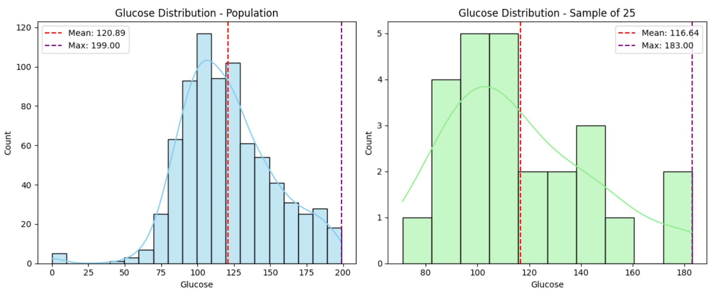
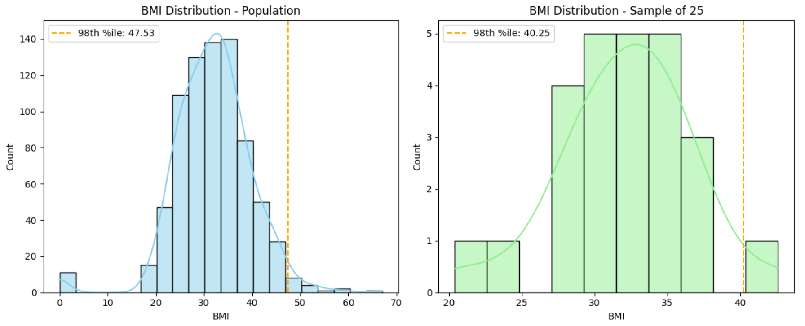
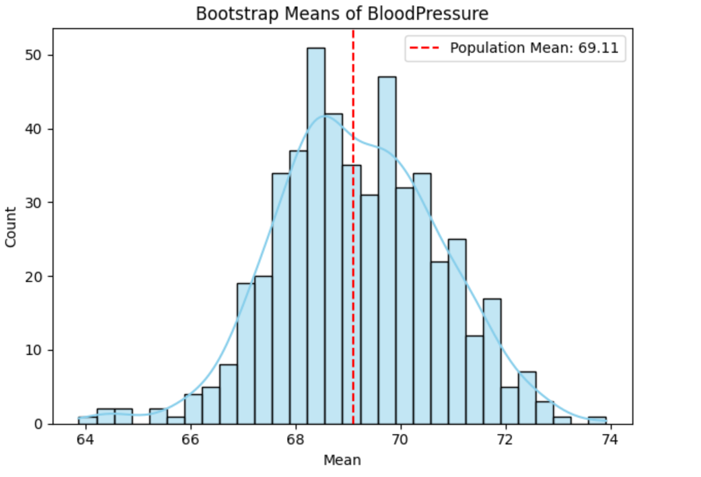
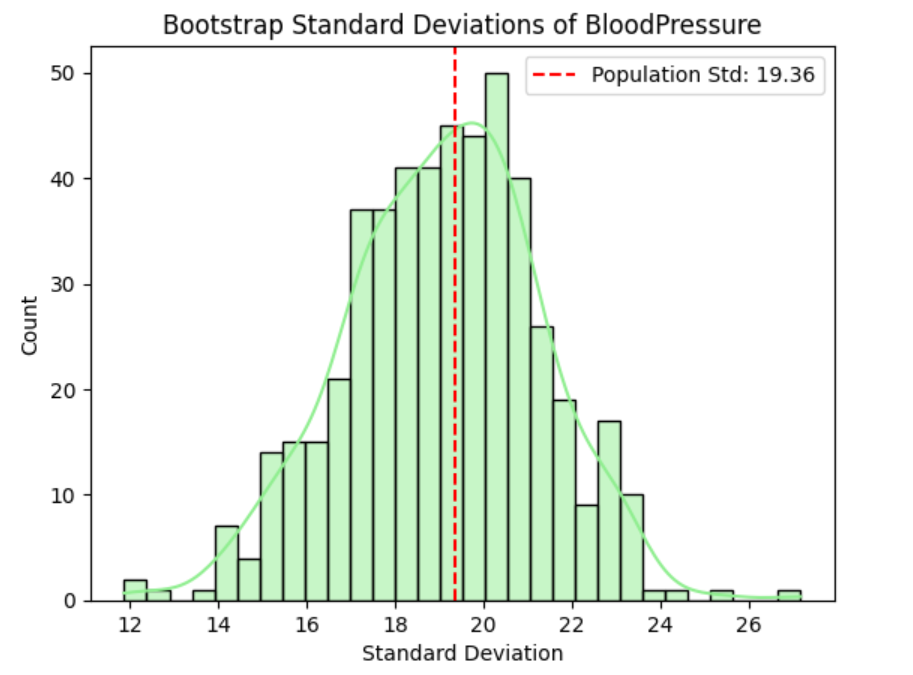
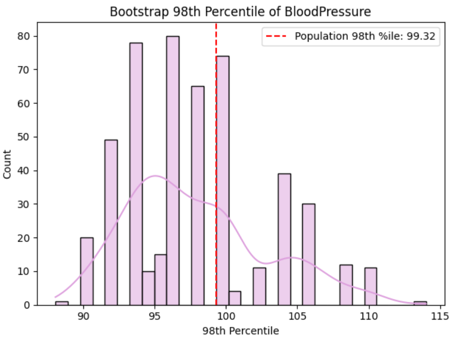

# PDS-Assgn-3-SP25

<strong>Data Link:</strong>

<a href='https://app.box.com/s/7qv44umhw0vnzgmoe9krfkfkv5kf2atv'>diabetes.csv</a>  

1. The data file diabetes.csv contains data of 768 patients. In this data there are 8 attributes
(Pregnancies, Glucose, BloodPressure, SkinThickness, Insulin, BMI, DiabetesPedigreeFunction, and Age)
and 1 response variable (Outcome). The response variable, Outcome, has binary value (1 indicating the
outcome is diabetes and 0 means no diabetes). For this assignment purposes we will consider this data
as a population. Use this data to perform the following:

<ol type='a'>
    <li>
        
set a seed (to ensure work reproducibility) and take a random sample of 25 observations and
        find the mean Glucose and highest Glucose values of this sample and compare these statistics
        with the population statistics of the same variable. You should use charts for this comparison.

        <h3>Findings: </h3>
        
        
The population distribution shows approximately normal distribution with a mean of 120.89 and a maximum of 199.00. The sample distribution is more irregular, with a mean of 116.64 and a maximum of 183.00. Comparatively Mean and Highest value of Population is higher than that of Sample.

    </li>
    <li>
        
Find the 98th percentile of BMI of your sample and the population and compare the results
        using charts.

        <h3>Findings: </h3>
        
        
The population's 98th percentile BMI is 47.53 and the sample's 98th percentile of 40.25 indicates that the sample did not captured the highest BMIs present in the population

    </li>
    <li>
        
Using bootstrap (replace= True), create 500 samples (of 150 observation each) from the
        population and find the average mean, standard deviation and percentile for BloodPressure and
        compare this with these statistics from the population for the same variable. Again, you should
        create charts for this comparison. Report on your findings.

        <h3>Findings: </h3>
        <ul>
            <li>
         
        
The dashed red line shows the true population mean of BloodPressure is at 69.11, which falls within the center of the distribution of sample means. The distribution of bootstrap sample means for BloodPressure appears approximately normal and ranges from approximately 64 to 74.

            </li>
            <li>
          
        
Bootstrap sample standard deviations for BloodPressure ranges from 12 to 27 center around the population standard deviation is 19.36, suggesting the resampling accurately captures the true variability.

            </li>
            <li>
          
        
The range of the bootstrapped sample 98th percentiles for BloodPressure, falls approximately between 90 to 115 whereas 98th percentile of population is 99.32. This suggests that the resampling method provides estimates that, on average, reflect the true 98th percentile of the population with some fluctuations.

            </li>
    </li>
</ol>

<strong>Submission:</strong>

Create a public GitHub repo and upload the folders for the assignment on the GitHub and submit the link to Canvas:

<a href="https://github.com/kevin3302/PDS-Assgn-3-SP25.git">Submission Link</a>
